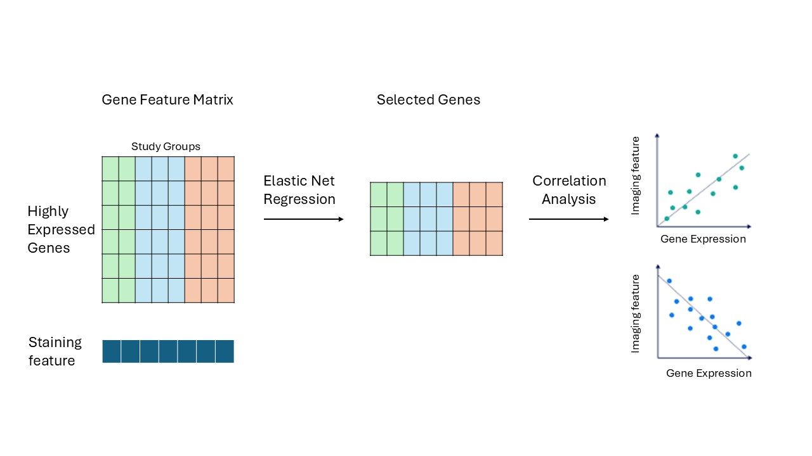

# Gene–Phenotype Analysis Pipeline
### Linking Bulk RNA-seq Expression to Quantitative Tissue Measurements

---

## Introduction

This pipeline is designed for studies where you have **bulk RNA-seq data** from patient tissue samples and a **quantitative phenotypic measurement** from the same patients — think histological staining scores, cell size measurements, or any numeric clinical readout. The goal is to identify which genes best predict that measurement, then validate and visualize those associations across your patient groups.

The strategy has two stages. First, we use **Elastic Net penalized regression** to select a compact list of candidate genes from what could be tens of thousands of expressed genes. This step is essential because standard regression breaks down when you have far more features than samples, which is almost always the case in transcriptomics. Second, we validate those candidates with **Pearson correlations** run separately within each patient group, apply FDR correction, and produce publication-ready visualizations.



The pipeline runs as five R scripts in sequence. Everything produced in one script feeds directly into the next.

---

## Before You Start

### Required R Packages

```r
# From CRAN
install.packages(c("tidyverse", "readxl", "glmnet", "ggplot2", "circlize"))

# From Bioconductor
if (!requireNamespace("BiocManager", quietly = TRUE)) install.packages("BiocManager")
BiocManager::install(c("biomaRt", "ComplexHeatmap"))
```

### Data You Will Need

| File | Format | Description |
|---|---|---|
| Gene count matrix | `.csv` | Rows = Ensembl gene IDs, columns = sample IDs. Must include a `gene_biotype` column. |
| Sample metadata | `.xlsx` | One row per sample. Must include `Sample`, `Region` (`"LV"` / `"RV"`), and `Etiology` (your group labels). |
| Phenotypic data | `.xlsx` | One row per patient. Must include `Patient ID` and one or more numeric outcome columns. |

### Adapting This Pipeline to Your Study

Throughout the tutorial, patient groups are referred to as **Group 1**, **Group 2**, and **Group 3**, with corresponding R variables named `group1_list`, `group2_list`, and `group3_list`. Replace these with whatever group labels make sense for your study.

Similarly, the outcome variable is written as `"your_outcome_column"` in all code — replace it with the exact column name from your phenotypic data file (e.g., `"Fibrosis_Percent"` or `"Cell_Area_um2"`).

---

## Script 1 — Preprocessing

**File:** `Preprocessing.R` | **Libraries:** `readxl`, `tidyverse`, `dplyr`

This script does all the groundwork. It loads your raw data, applies quality control, and organizes everything into structured per-group lists that every downstream script depends on. Running this first — and making sure it completes without errors — saves a lot of headaches later.

### Load and Clean the Data

```r
library(readxl)
library(tidyverse)
library(dplyr)

# Load your phenotypic/staining data.
# If your Etiology column has verbose labels like "Group 1 (subtype A)",
# use fct_recode() to simplify them into short, consistent labels.
staining_data <- readxl::read_excel("path/to/staining_data.xlsx") %>%
  mutate(Etiology = fct_recode(Etiology,
                               "Group 1" = "Group 1 (subtype A)",
                               "Group 2" = "Group 2 (subtype B)")) %>%
  select(-Age, -Sex, -BMI)   # drop any columns not needed downstream

# Load RNA-seq count matrix and sample metadata
raw_count <- read.csv("path/to/gene_count.csv")
metadata  <- read_excel("path/to/metadata.xlsx")

# Remove flagged outlier samples if you have any.
# If not, just remove the filter() line entirely.
total_metadata <- metadata %>%
  filter(!Sample %in% c("OUTLIER_SAMPLE_1", "OUTLIER_SAMPLE_2")) %>%
  column_to_rownames(var = "Sample")

# Keep only protein-coding genes and align to the samples in metadata
total_count <- raw_count %>%
  filter(gene_biotype == "protein_coding") %>%
  column_to_rownames(var = "gene_id") %>%
  select(all_of(rownames(total_metadata)))

rm(raw_count, metadata)   # clean up memory
```

### Split by Tissue Region

If your study includes samples from more than one tissue region (e.g., left ventricle and right ventricle), this function carves the full dataset into region-specific subsets.

```r
create_subset <- function(full_counts, full_meta, region_name) {
  sub_meta  <- full_meta %>% filter(Region == region_name)
  sub_count <- full_counts %>% select(all_of(rownames(sub_meta)))
  list(count = sub_count, metadata = sub_meta)
}

LV_data <- create_subset(total_count, total_metadata, "LV")
RV_data <- create_subset(total_count, total_metadata, "RV")
```

Each output is a named list with `$count` (genes × samples matrix) and `$metadata` (sample information).

### Bundle Data by Patient Group

This is the most important preprocessing step. `get_etiology_data()` packages the staining measurements and count matrices together for a single patient group. It also applies a minimum expression filter — a gene must have at least **10 raw counts in every sample** in that group to be retained. This cuts out genes that are too lowly expressed to be meaningful and keeps the model focused on reliably detected signal.

```r
get_etiology_data <- function(etiology_name,
                              full_staining,
                              full_lv_list,
                              full_rv_list) {

  # Strip region/group suffixes from sample IDs so they match across datasets.
  # For example: "A0049_LV_Group1" becomes "A0049".
  # Adjust the regex if your sample ID format is different.
  clean_ids <- function(names_vec) str_extract(names_vec, "^[A-Z][0-9]+")

  # Filter staining data for this group
  sub_staining <- full_staining %>% filter(Etiology == etiology_name)

  # LV data: filter, clean IDs, apply expression filter
  lv_meta_sub  <- full_lv_list$metadata %>% filter(Etiology == etiology_name)
  lv_count_sub <- full_lv_list$count %>% select(all_of(rownames(lv_meta_sub)))
  colnames(lv_count_sub) <- clean_ids(colnames(lv_count_sub))
  rownames(lv_meta_sub)  <- clean_ids(rownames(lv_meta_sub))
  lv_count_sub <- lv_count_sub[apply(lv_count_sub, 1, min) >= 10, ]

  # RV data: same process
  rv_meta_sub  <- full_rv_list$metadata %>% filter(Etiology == etiology_name)
  rv_count_sub <- full_rv_list$count %>% select(all_of(rownames(rv_meta_sub)))
  colnames(rv_count_sub) <- clean_ids(colnames(rv_count_sub))
  rownames(rv_meta_sub)  <- clean_ids(rownames(rv_meta_sub))
  rv_count_sub <- rv_count_sub[apply(rv_count_sub, 1, min) >= 10, ]

  list(
    staining    = sub_staining,
    LV_metadata = lv_meta_sub,
    LV_count    = lv_count_sub,
    RV_metadata = rv_meta_sub,
    RV_count    = rv_count_sub
  )
}

# Build one list per group — replace the labels with your own Etiology values
group1_list <- get_etiology_data("Group 1", staining_data, LV_data, RV_data)
group2_list <- get_etiology_data("Group 2", staining_data, LV_data, RV_data)
group3_list <- get_etiology_data("Group 3", staining_data, LV_data, RV_data)
```

**After this script, you should have:**

| Variable | What it contains |
|---|---|
| `staining_data` | Full phenotypic data (all groups combined) |
| `LV_data`, `RV_data` | Count matrix + metadata, split by region |
| `group1_list`, `group2_list`, `group3_list` | Staining + count + metadata, split by group |

> **Note:** If you want to restrict the gene set going into Elastic Net — for example, to genes that are differentially expressed between two of your groups — you can pre-filter the count matrices before calling `get_etiology_data()`. Replacing `total_count` with a filtered version (keeping only your genes of interest) is all that's needed; the rest of the pipeline stays the same.

---

## Script 2 — Elastic Net

**File:** `Elastic Net.R` | **Libraries:** `glmnet`, `tidyverse`, `biomaRt`

With the data organized, we can now run the model. Elastic Net is a penalized regression method that shrinks most gene coefficients to zero, keeping only the ones with genuine predictive value. It's well-suited here because we typically have thousands of candidate genes but only tens of samples — a situation where ordinary regression completely fails.

We use **Leave-One-Out Cross-Validation (LOOCV)** to find the optimal regularization strength. In small clinical cohorts, LOOCV makes the most efficient use of the available data and avoids overly optimistic model selection.

### Step 1 — Prepare the Predictor Matrix

```r
library(glmnet)
library(tidyverse)
library(biomaRt)

prepare_elastic_net <- function(data_list, region = "LV", target_col,
                                adjustment_cols = NULL) {

  count_df <- if (region == "LV") data_list$LV_count else data_list$RV_count
  meta_df  <- if (region == "LV") data_list$LV_metadata else data_list$RV_metadata

  # Log2-transform counts and transpose to samples × genes
  X_genes <- t(log2(count_df + 1))

  # Keep only samples present in both the RNA-seq and phenotypic data
  common_samples <- intersect(rownames(X_genes), data_list$staining$`Patient ID`)
  X_genes        <- X_genes[common_samples, ]

  # Extract the outcome variable
  y <- data_list$staining %>%
    filter(`Patient ID` %in% common_samples) %>%
    pull(!!sym(target_col))

  # Drop samples with missing outcome values
  non_na_idx     <- !is.na(y)
  y              <- y[non_na_idx]
  X_genes        <- X_genes[non_na_idx, ]
  common_samples <- common_samples[non_na_idx]

  # Optionally include covariates (e.g., Age). These will be scaled but NOT penalized.
  if (!is.null(adjustment_cols) && length(adjustment_cols) > 0) {
    adj_mat    <- meta_df[common_samples, adjustment_cols, drop = FALSE]
    adj_scaled <- scale(adj_mat)
    X_final    <- cbind(adj_scaled, X_genes)
  } else {
    X_final <- X_genes
  }

  list(X = X_final, y = y)
}
```

### Step 2 — Fit the Model and Extract Selected Genes

```r
run_elastic_net_full <- function(X, y, alpha = 0.1, n_adj = 0) {

  # Adjustment covariates (first n_adj columns) get penalty = 0,
  # so they're always kept regardless of regularization strength.
  # All gene columns get penalty = 1.
  p.fac <- c(rep(0, n_adj), rep(1, ncol(X) - n_adj))

  set.seed(42)
  custom_lambdas <- 10^seq(2, -5, length.out = 100)

  cv_fit <- cv.glmnet(X, y,
                      alpha          = alpha,
                      penalty.factor = p.fac,
                      lambda         = custom_lambdas,
                      standardize    = TRUE,
                      nfolds         = nrow(X),   # LOOCV
                      grouped        = FALSE)

  # Capture the cross-validation curve as a reusable plot object
  pdf(NULL)
  dev.control(displaylist = "enable")
  plot(cv_fit)
  title(paste("Cross-Validation (alpha =", alpha, ")"), line = 2.5)
  cv_plot <- recordPlot()
  dev.off()

  # Extract non-zero coefficients at the optimal lambda
  full_coefs <- coef(cv_fit, s = "lambda.min")
  adj_names  <- colnames(X)[seq_len(n_adj)]

  coef_df <- data.frame(
    Gene        = rownames(full_coefs),
    Coefficient = as.vector(full_coefs)
  ) %>%
    filter(Coefficient != 0)

  # Separate biological genes from the intercept and covariates
  genes_to_map <- coef_df %>%
    filter(!Gene %in% c("(Intercept)", adj_names))

  # Resolve Ensembl IDs to human-readable gene symbols via Ensembl
  if (nrow(genes_to_map) > 0) {
    mart     <- useEnsembl(biomart = "genes", dataset = "hsapiens_gene_ensembl")
    gene_map <- getBM(
      attributes = c("ensembl_gene_id", "external_gene_name"),
      filters    = "ensembl_gene_id",
      values     = genes_to_map$Gene,
      mart       = mart
    )
    coef_df <- coef_df %>%
      left_join(gene_map, by = c("Gene" = "ensembl_gene_id")) %>%
      mutate(Gene_Symbol = ifelse(!is.na(external_gene_name),
                                  external_gene_name, Gene))
  } else {
    coef_df$Gene_Symbol <- coef_df$Gene
  }

  coef_df <- coef_df %>%
    dplyr::select(Gene, Gene_Symbol, Coefficient) %>%
    arrange(desc(abs(Coefficient)))

  list(model = cv_fit, plot = cv_plot, coeffs = coef_df)
}
```

### Run It

```r
# Prepare predictors for Group 1, LV, adjusting for Age
prep <- prepare_elastic_net(
  data_list       = group1_list,
  region          = "LV",
  target_col      = "your_outcome_column",
  adjustment_cols = "Age"          # set to NULL if you have no covariates
)

# Fit the model
results <- run_elastic_net_full(
  X     = prep$X,
  y     = prep$y,
  alpha = 0.05,
  n_adj = 1         # must match the number of adjustment_cols you used above
)

print(results$coeffs)   # table of selected genes and their coefficients
print(results$plot)     # cross-validation curve — inspect this to check model fit
```

**Understanding the key parameters:**

| Parameter | What it controls |
|---|---|
| `alpha` | Mix between Ridge (0) and LASSO (1). Values near 0 group correlated genes together rather than arbitrarily dropping one. Start with 0.05–0.1. |
| `n_adj` | Number of adjustment covariates at the start of `X`. Must match `length(adjustment_cols)` from `prepare_elastic_net`. |
| `lambda.min` | The regularization strength that minimized CV error — used automatically to extract coefficients. |

`results$coeffs` is a data frame of selected genes with Ensembl IDs, gene symbols, and regression coefficients sorted by effect size. This is what feeds into Script 3.

---

## Script 3 — Correlation Analysis

**File:** `Correlation Analysis.R` | **Libraries:** `tidyverse`, `biomaRt`

Elastic Net gives us a shortlist of candidate genes, but we want to know how each one actually correlates with the outcome — and whether that relationship holds across all of your patient groups or is specific to one. This script runs Pearson correlations for every selected gene within each group separately, then applies Benjamini–Hochberg FDR correction.

```r
library(tidyverse)
library(biomaRt)

run_comparative_correlation <- function(data_list, target_genes,
                                        target_var, region = "LV") {

  count_df <- if (region == "LV") data_list$LV_count else data_list$RV_count

  # Only test genes that actually exist in this group's count matrix
  available_genes <- intersect(target_genes, rownames(count_df))
  common_samples  <- intersect(colnames(count_df), data_list$staining$`Patient ID`)

  count_subset    <- count_df[available_genes, common_samples, drop = FALSE]
  staining_subset <- data_list$staining %>% filter(`Patient ID` %in% common_samples)

  # Log-transform expression and z-score both variables before correlating
  expr_matrix_log <- as.matrix(log2(count_subset + 1))
  target_vec      <- staining_subset %>% pull(!!sym(target_var))
  target_scaled   <- as.vector(scale(target_vec))

  results <- map_dfr(available_genes, function(gene) {
    gene_expr_scaled <- as.vector(scale(expr_matrix_log[gene, ]))
    cor_test         <- cor.test(gene_expr_scaled, target_scaled, method = "pearson")
    data.frame(
      Gene                = gene,
      Mean_Expression_Raw = mean(as.numeric(count_subset[gene, ])),
      Pearson_R           = as.numeric(cor_test$estimate),
      P_Value             = cor_test$p.value
    )
  })

  # Attach gene symbols
  mart         <- useEnsembl(biomart = "genes", dataset = "hsapiens_gene_ensembl")
  gene_symbols <- getBM(
    attributes = c("ensembl_gene_id", "external_gene_name"),
    filters    = "ensembl_gene_id",
    values     = available_genes,
    mart       = mart
  )

  results %>%
    left_join(gene_symbols, by = c("Gene" = "ensembl_gene_id")) %>%
    rename(Gene_Symbol = external_gene_name) %>%
    mutate(Adj_P_Value = p.adjust(P_Value, method = "fdr")) %>%
    dplyr::select(Gene, Gene_Symbol, Mean_Expression_Raw,
                  Pearson_R, P_Value, Adj_P_Value) %>%
    arrange(P_Value)
}

# Run for each group using the genes selected by Elastic Net
group1_corr_results <- run_comparative_correlation(
  group1_list, results$coeffs$Gene, "your_outcome_column", "LV")

group2_corr_results <- run_comparative_correlation(
  group2_list, results$coeffs$Gene, "your_outcome_column", "LV")

group3_corr_results <- run_comparative_correlation(
  group3_list, results$coeffs$Gene, "your_outcome_column", "LV")
```

Each output data frame has columns: `Gene`, `Gene_Symbol`, `Mean_Expression_Raw`, `Pearson_R`, `P_Value`, `Adj_P_Value`, sorted by raw p-value.

---

## Script 4 — Correlation Heatmap

**File:** `Corr heatmap.R` | **Libraries:** `ComplexHeatmap`, `circlize`, `tidyverse`

Now we bring all three groups' results together in a single visualization. The heatmap gives you an immediate read on which genes correlate strongly (and in which direction) across groups, and where those correlations are statistically significant.

- **Color** encodes Pearson r: blue = negative correlation, white = no correlation, red = positive
- **Black squares** inside each cell encode FDR significance: larger square = smaller p-value

```r
library(ComplexHeatmap)
library(circlize)
library(tidyverse)

# Combine results from all groups into one long data frame
all_results <- list(
  "Group 1" = group1_corr_results,
  "Group 2" = group2_corr_results,
  "Group 3" = group3_corr_results
) %>%
  bind_rows(.id = "Etiology") %>%
  mutate(Etiology = factor(Etiology, levels = c("Group 1", "Group 2", "Group 3")))

# Choose which genes to display — pick one option below:

# Option A: all genes that pass FDR in any group (good for a focused gene set)
genes <- all_results %>%
  filter(Adj_P_Value < 0.05) %>%
  pull(Gene_Symbol)

# Option B: top 20 genes by absolute r in Group 1 (useful when many genes pass FDR)
genes <- all_results %>%
  filter(Adj_P_Value < 0.05, Etiology == "Group 1") %>%
  top_n(20, abs(Pearson_R)) %>%
  pull(Gene_Symbol)

# Build wide matrices: one for r-values, one for FDR-adjusted p-values
cor_mat <- all_results %>%
  filter(Gene_Symbol %in% genes) %>%
  dplyr::select(Etiology, Gene_Symbol, Pearson_R) %>%
  pivot_wider(names_from = Gene_Symbol, values_from = Pearson_R) %>%
  column_to_rownames("Etiology") %>%
  as.matrix()
cor_mat[is.na(cor_mat)] <- 0    # missing = no correlation

pval_mat <- all_results %>%
  filter(Gene_Symbol %in% genes) %>%
  dplyr::select(Etiology, Gene_Symbol, Adj_P_Value) %>%
  pivot_wider(names_from = Gene_Symbol, values_from = Adj_P_Value) %>%
  column_to_rownames("Etiology") %>%
  as.matrix()
pval_mat[is.na(pval_mat)] <- 1  # missing = not significant

# Fix row order; sort columns by correlation strength in Group 1.
# Change "Group 1" to whichever group you want to anchor the column order to.
row_order_names <- c("Group 1", "Group 2", "Group 3")
col_order_names <- names(sort(cor_mat["Group 1", ], decreasing = TRUE))

col_fun <- colorRamp2(c(-1, 0, 1), c("#2166ac", "white", "#b2182b"))

ht <- Heatmap(
  cor_mat,
  name   = "Correlation (r)",
  col    = col_fun,
  width  = ncol(cor_mat) * unit(10, "mm"),
  height = nrow(cor_mat) * unit(10, "mm"),

  cluster_rows    = FALSE,
  row_order       = row_order_names,
  cluster_columns = FALSE,
  column_order    = col_order_names,

  column_names_side = "bottom",
  column_names_rot  = 45,
  column_names_gp   = gpar(fontface = "bold", fontsize = 14),
  row_names_gp      = gpar(fontface = "bold", fontsize = 14),

  # Draw a black square inside each cell — size encodes significance
  cell_fun = function(j, i, x, y, width, height, fill) {
    curr_row <- row_order_names[i]
    curr_col <- col_order_names[j]
    p_val    <- pval_mat[curr_row, curr_col]

    s <- ifelse(p_val < 0.001, 0.70,
         ifelse(p_val < 0.01,  0.45,
         ifelse(p_val < 0.05,  0.25, 0)))

    if (s > 0)
      grid.rect(x, y,
                width  = width  * s,
                height = height * s,
                gp     = gpar(fill = "black", col = NA))
  }
)

# Significance legend explaining the square sizes
sig_lgd <- Legend(
  title     = "FDR",
  labels    = c("p < 0.001", "p < 0.01", "p < 0.05"),
  type      = "points",
  pch       = 15,
  size      = unit(c(0.7, 0.45, 0.25) * 8, "mm"),
  legend_gp = gpar(col = "black")
)

draw(ht, annotation_legend_list = list(sig_lgd))
```

---

## Script 5 — Scatter Plots

**File:** `Corr scatter plot.R` | **Libraries:** `ggplot2`, `tidyverse`, `biomaRt`

The heatmap gives an overview; scatter plots let you inspect individual genes. For any gene of interest, this script produces a single panel with all groups overlaid — each group gets its own color, regression line, and annotated r and p-values.

One thing worth noting: the expression filter from Script 1 (requiring ≥ 10 counts in every sample) may have excluded some genes from the model that you still want to visualize. The data-loading function here deliberately skips that filter, so any gene in your count matrix can be plotted.

### Build an Unfiltered Data List

```r
library(ggplot2)
library(tidyverse)
library(biomaRt)

get_etiology_data_for_scatter <- function(etiology_name,
                                          full_staining,
                                          full_lv_list,
                                          full_rv_list) {

  clean_ids <- function(names_vec) str_extract(names_vec, "^[A-Z][0-9]+")

  sub_staining <- full_staining %>% filter(Etiology == etiology_name)

  lv_meta_sub  <- full_lv_list$metadata %>% filter(Etiology == etiology_name)
  lv_count_sub <- full_lv_list$count %>% dplyr::select(all_of(rownames(lv_meta_sub)))
  colnames(lv_count_sub) <- clean_ids(colnames(lv_count_sub))
  rownames(lv_meta_sub)  <- clean_ids(rownames(lv_meta_sub))
  # No expression filter here — keep all genes for plotting

  rv_meta_sub  <- full_rv_list$metadata %>% filter(Etiology == etiology_name)
  rv_count_sub <- full_rv_list$count %>% dplyr::select(all_of(rownames(rv_meta_sub)))
  colnames(rv_count_sub) <- clean_ids(colnames(rv_count_sub))
  rownames(rv_meta_sub)  <- clean_ids(rownames(rv_meta_sub))

  list(
    staining    = sub_staining,
    LV_metadata = lv_meta_sub,
    LV_count    = lv_count_sub,
    RV_metadata = rv_meta_sub,
    RV_count    = rv_count_sub
  )
}

# Build the list for all groups (no expression filter)
data_full_list <- lapply(
  setNames(c("Group 1", "Group 2", "Group 3"),
           c("Group 1", "Group 2", "Group 3")),
  function(etio) {
    get_etiology_data_for_scatter(etio, staining_data, LV_data, RV_data)
  }
)
```

### Plot Function

```r
plot_gene_correlation_combined <- function(data_full_list, target_gene_id,
                                           target_var, region = "LV") {

  # Resolve Ensembl ID to gene symbol for axis labeling
  mart      <- useEnsembl(biomart = "genes", dataset = "hsapiens_gene_ensembl")
  gene_info <- getBM(
    attributes = c("ensembl_gene_id", "external_gene_name"),
    filters    = "ensembl_gene_id",
    values     = target_gene_id,
    mart       = mart
  )
  gene_symbol <- if (nrow(gene_info) > 0) gene_info$external_gene_name[1] else target_gene_id

  # Extract log2-transformed expression and staining values for each group
  get_group_df <- function(group_list, group_name) {
    count_df <- if (region == "LV") group_list$LV_count else group_list$RV_count
    if (!(target_gene_id %in% rownames(count_df))) return(NULL)
    expr <- log2(as.numeric(count_df[target_gene_id, ]) + 1)
    data.frame(Patient_ID = colnames(count_df), Expression = expr) %>%
      inner_join(group_list$staining, by = c("Patient_ID" = "Patient ID")) %>%
      dplyr::select(Expression, !!sym(target_var)) %>%
      mutate(Group = group_name)
  }

  combined_df <- bind_rows(
    get_group_df(data_full_list[["Group 1"]], "Group 1"),
    get_group_df(data_full_list[["Group 2"]], "Group 2"),
    get_group_df(data_full_list[["Group 3"]], "Group 3")
  ) %>%
    mutate(Group = factor(Group, levels = c("Group 1", "Group 2", "Group 3"))) %>%
    drop_na(Expression, !!sym(target_var))

  # Per-group Pearson r and p-value, with FDR correction across groups
  stats_df <- combined_df %>%
    group_by(Group) %>%
    summarize(
      r = cor(Expression, !!sym(target_var), method = "pearson", use = "complete.obs"),
      p = if (n() > 2) cor.test(Expression, !!sym(target_var))$p.value else 1
    ) %>%
    ungroup() %>%
    mutate(
      padj  = p.adjust(p, method = "fdr"),
      label = paste0(Group, ": p=", signif(p, 3), ", r=", round(r, 2)),
      y_pos = seq(
        max(combined_df[[target_var]], na.rm = TRUE),
        by     = -diff(range(combined_df[[target_var]], na.rm = TRUE)) * 0.06,
        length.out = n()
      )
    )

  ggplot(combined_df, aes(x = Expression, y = !!sym(target_var), color = Group)) +
    geom_point(alpha = 0.5, size = 3) +
    geom_smooth(method = "lm", se = FALSE, linewidth = 1.2, na.rm = TRUE) +
    geom_text(
      data  = stats_df,
      aes(x = -Inf, y = y_pos, label = label, color = Group),
      hjust = -0.1, vjust = 1, size = 3.8, fontface = "bold", show.legend = FALSE
    ) +
    scale_color_manual(values = c(
      "Group 1" = "#de425b",   # red   — change to your preference
      "Group 2" = "#329db3",   # teal
      "Group 3" = "#488f31"    # green
    )) +
    theme_bw() +
    labs(
      x = paste(gene_symbol, "Normalized Expression (", region, ")"),
      y = target_var
    ) +
    theme(
      legend.position = "none",
      axis.title      = element_text(size = 11, face = "bold"),
      axis.text       = element_text(size = 11, face = "bold"),
      plot.title      = element_text(face = "bold")
    )
}

# Generate a plot — replace the Ensembl ID and outcome column with your own
plot_gene_correlation_combined(
  data_full_list,
  target_gene_id = "ENSG00000000000",    # replace with your gene of interest
  target_var     = "your_outcome_column",
  region         = "LV"
)
```

> **Colors:** Group 1 is red (`#de425b`), Group 2 is teal (`#329db3`), Group 3 is green (`#488f31`). Edit `scale_color_manual()` to use your preferred palette.

---

## Data Flow Summary

```
Preprocessing.R
│
│   staining_data, LV_data, RV_data
│   group1_list, group2_list, group3_list
│
├──► Elastic Net.R
│        │
│        │   results$coeffs  (selected genes + coefficients)
│        │
│        └──► Correlation Analysis.R
│                  │
│                  │   group1_corr_results
│                  │   group2_corr_results
│                  │   group3_corr_results
│                  │
│                  ├──► Corr heatmap.R
│                  │        └── Heatmap: all groups × selected genes
│                  │
│                  └──► Corr scatter plot.R
│                           └── Per-gene scatter: expression vs. outcome
│
└──► Corr scatter plot.R  (also reads staining_data, LV_data, RV_data directly)
```

---

## Key Variables Carried Between Scripts

| Variable | Produced in | Used in |
|---|---|---|
| `staining_data` | Preprocessing | Elastic Net, Scatter Plot |
| `LV_data`, `RV_data` | Preprocessing | Elastic Net, Scatter Plot |
| `group1_list`, `group2_list`, `group3_list` | Preprocessing | Elastic Net, Correlation Analysis |
| `results$coeffs` | Elastic Net | Correlation Analysis |
| `group1_corr_results`, `group2_corr_results`, `group3_corr_results` | Correlation Analysis | Heatmap |
